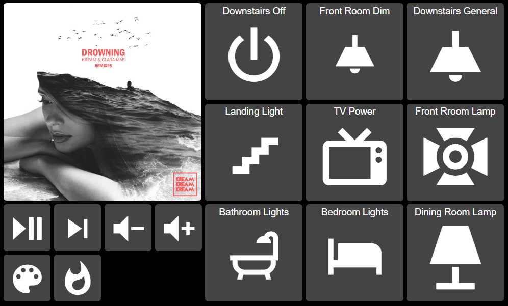

# My Setup
I run [Home Assistant](http://homeassistant.io/) in a docker contatiner on a Raspberry Pi 3. Details of my docker setup can be found in the [docker folder](https://github.com/Dullage/Home-AssistantConfig/tree/master/docker).

Currently there is very little in terms of in-configuration comments but if anyone has any questions I'm happy to answer.

# Presence Detection
After a lot of trial and error I have found the following setup works very well for me with little lag or error rate.

I use 3 platforms for presence detection:

1. [Locative iOS App](https://www.home-assistant.io/components/device_tracker.locative/)
2. [Home Assistant iOS App](https://www.home-assistant.io/docs/ecosystem/ios/)
3. [Ubiquiti Wifi](https://www.home-assistant.io/components/device_tracker.unifi/)

I use the 3 platforms with the following logic:

* For each household member the Locative and the Home Assistant iOS App devices are combined into a group. This group is what I use to trigger automations etc.
* If either of the app devices changes to "away" an automation will also set the other device to "away" so that the group is also changed to "away". _Note: I don't need to do the same for a change to "home" as only 1 device in the group needs to show as "home" for the group to show as "home"._
* If the Unifi device changes to "home" an automation sets both of the app devices as "home" (thus also changing the group to "home"). This is the only way I use the Unifi device tracker as the change to "away" is both slow and un-reliable.

The logic for the automations mentioned above can be found in the automation file [locationCleanup.yaml](https://github.com/Dullage/Home-AssistantConfig/blob/master/automations/locationCleanup.yaml).

# Highlights
Some highlights of our setup in no particular order:

* Google Home Minis for voice control and voice notifications (Google Cast) in most areas of the house.
* Chromecast Audios for whole house audio.
* Most house lights controllable via Home Assistant (a mix of Hue, Sonoff and WS2812 LED strips).
* Nest Thermostat.
* Broadlink RM Mini IR blaster for AV control.
* Motion detection for some lighting effects (Xiaomi Motion Sensors).
* The heating turns itself off as we goto bed (**/automations/bedtime.yaml** or **/scripts/alexaRoutines.yaml**:alexa_goodnight).
* All lights turn off if everyone leaves the house. Lights turn on (at night) when someone comes home (/automations/locationLights.yaml).
* ESP8266 controlled ceiling lights (see [this forum post](https://community.home-assistant.io/t/esp8266-sonoff-controlled-ceiling-lights/24141)).
* Double toggle a wall switch to perform a special function e.g. turn off every light on that floor (see [this repo](https://github.com/Dullage/SwitchedSonoffSimple) and **/automations/switchDoubleToggles.yaml**).
* iOS notifications when the doorbell is pressed (**/automations/doorbell.yaml**). These include a video of the person walking up the path (see [this forum post](https://community.home-assistant.io/t/blink-camera-as-video-doorbell/65844)).
* iOS notifications if we both leave the house but a door is left open (**/automations/locationDoorWarning.yaml**).
* RaspberryPi Screen running HADashboard. Screen turns on and off based on motion by the screen.
* Smart Microwave! See [this forum post](https://community.home-assistant.io/t/making-my-microwave-smart-ish/89843) and [this automation](/automations/microwave.yaml).

# Screenshots
Here are some screenshots from the front end and HA Dashboard:

## Main Tab

## Climate Tab

## AV Tab

## Miscellaneous Tab

## Camera Tab

## Admin Tab

## HA Dashboard

